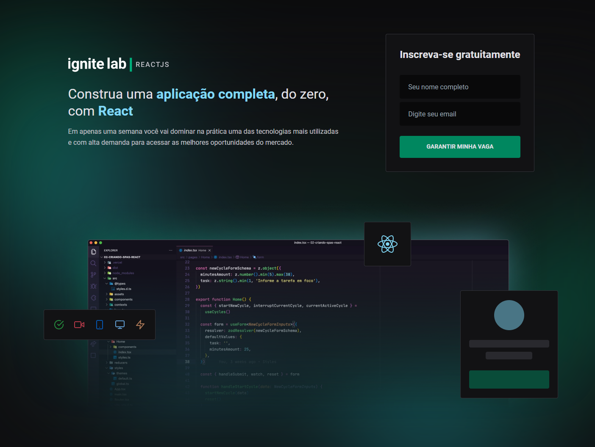

# Ignite Lab Event Platform



## 💻 O projeto

Aplicação desenvolvida durante o Ignite Lab, evento oferecido pela [Rocketseat](https://rocketseat.com.br/), que consiste em uma plataforma para a realização de eventos on-line, onde cada aula é disponibilizada em um dia específico da semana.

Todas as aulas disponibilizadas no evento são cadastradas no [GraphCMS](https://graphcms.com/), uma ferramenta CMS que oferece uma API GraphQL de conteúdos, sendo utilizada tanto na criação das aulas, cadastradas no próprio painel da ferramenta, quanto a gravação de inscritos (através das Mutations do GraphQL)no banco de dados da ferramenta.

🖱️ - [Clique aqui e veja a aplicação!](https://ignite-lab-event-platform-seven.vercel.app/)

[Design Do Figma](<https://www.figma.com/file/Psv3GmRVAw3AI1dgL9pdD0/Plataforma-de-evento---Ignite-Lab-(Community)?node-id=8%3A399>)

## 🍃 Tecnologias

- [ ] Vite
- [ ] React
- [ ] Typescript
- [ ] TailwindCSS
- [ ] GraphQL
- [ ] Apollo
- [ ] Codegen GraphQL
- [ ] vime
- [ ] React-toastfy

## 🚀Como executar

Clone o repositório:

```bash
git clone https://github.com/imatheus-lucas/ignite-lab-event-platform.git
```

Execute os comandos:

A aplicação estará disponível no seu browser pelo endereço http://localhost:3000.
